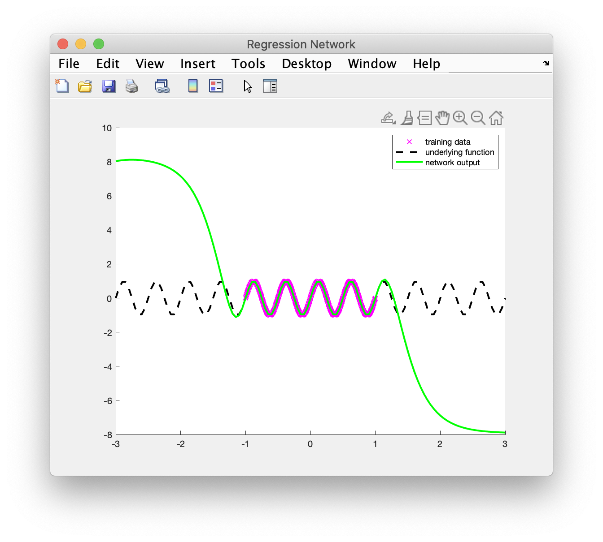

# Regression Neural Network

A MATLAB script for visualizing a feedforward neural network's understanding of a math function under different parameters

## Background

This code was part of a final project submission for the class _Psychology 186B - Cognitive Science Laboratory: Neural Networks_, which I took at UCLA in the Spring of 2020. The assignment was completely open-ended so my partner and I made the following proposal:

> Our final project would like to address the following questions: How well do neural networks realize mathematical functions? What aspects of a neural network can be changed to better model, say, a sine or exponential function? The textbook explores ways to teach a neural network arithmetic but our project is concerned with function fitting (nonlinear regression). The following is a link to previous work we found:
>
> https://towardsdatascience.com/can-machine-learning-model-simple-math-functions-d336cf3e2a78
>
> However, they focus on using a wide variety of ML techniques rather than deeply exploring neural networks and all the possible parameter settings that can be used to improve their fidelity. Also, they only test linear, exponential, and modulus functions; we plan to test these along with other functions. Professor Liu has stated that neural networks are much better at ​interpolating than ​extrapolating​; we plan to test the extent to which this is true along with other conjectures. To test, we will use real functions to generate sample input/output pairs (x, f(x)) and use these pairs to train a neural network written in MATLAB. Then we plan to test how well the trained network can predict outputs of the same functions for other sets of random inputs. We are fully prepared to see suboptimal performance based on existing work, but we hope to discover when (and for which functions) a neural network can accurately model a function (at 90% accuracy). We will also search the literature afterwards to further understand our conclusions.

Once our proposal got approved, we did more research, wrote this code, then conducted our experiment which is described by [this paper](https://docs.google.com/document/d/1BJueUqw6ZWcA8GY1SZ9VjgYXEnk_0i83Q0p3hrTStiE/edit?usp=sharing). While we weren't able to test everything outlined in our proposal, we still learned a lot and received an A on the project.

## Running Locally

To run the code locally, you'll need [MATLAB](https://www.mathworks.com/products/matlab.html) and the [_Deep Learning Toolbox_](https://www.mathworks.com/products/deep-learning.html) installed. From there, downloading and running the code should be fairly straightforward.

## Making Changes

### `func.m`

- The function that isn't commented out is the function that the neural network will try to model.

### `function.m`

- `n_samp` represents the number of samples that will make up the training data.

- `noise_coeff` represents the amount of noise that will be present in the training data.

- `hidden_sizes` represents the complexity of the neural network; i.e., the number of layers in the network and the number of nodes in each layer.
